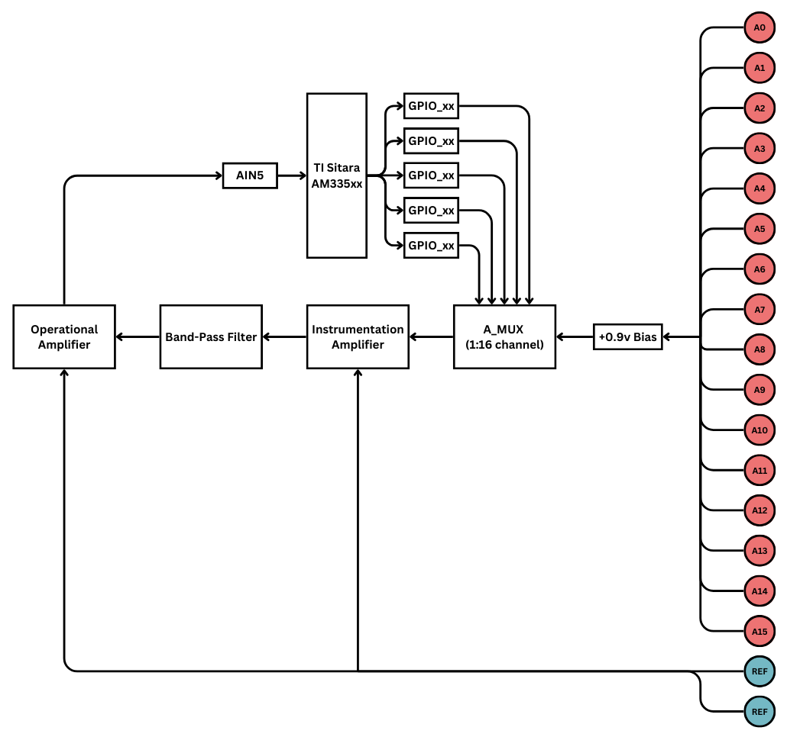
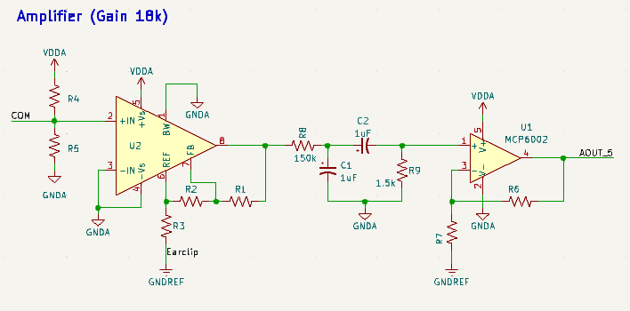
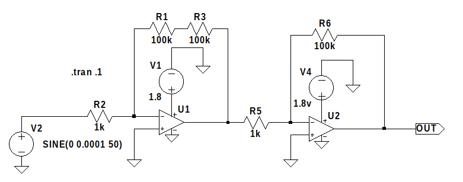

# The Quron Project Report 1

**Author**: Martin McCorkle
**Email**: mamccorkle1@ualr.edu
**Date**: November 10, 2024

## 1. Project Goal
With industry-leading 8 and 16-channel EEG monitoring devices retailing for upwards of \$2,000 and \$3,500, respectively, there is a growing need for affordable, entry-level alternatives as the BCI market continues to expand. The Quron Project builds on well-documented hardware and aims to provide a cost-effective, open-source solution, making neuroscience education more accessible for individual makers, students, and university programs.

## 2. Progress Overview
### **2.1 Hardware Selection**
I will be using the BeagleBoard Black (BBB) as the primary board for development of the first prototype. The BBB is an ideal choice for the first prototype of the Quron Project due to its affordability, ample processing power, and extensive I/O capabilities, which are crucial for handling multiple EEG channels. Its well-documented support for Linux-based development also facilitates rapid prototyping and testing, making it suitable for an open-source, accessible design.

### **2.2 Initial Circuit Design**
The analog circuit is designed with an input bias, pre-amplifier, band-pass filter, amplifier, and analog multiplexer.

#### **2.2.1 Input Bias**
**Description:** Sets a stable reference voltage for accurate signal detection.  
Resistor values R1 and R2 are calculated using the following equation:
$$ V_{bias} = V_{DDA} \times \frac{R_2}{R_1 + R_2} $$

With the BBB's $ V_{DDA} $ equal to $ 1.8V $ and $ A\_GND $ equal to $ 0V $, the signal will need to be biased to $ \frac{1}{2}(V_{DDA}) $.
$$ \frac{1}{2}(V_{DDA}) = 1.8V \times \frac{1k\Omega}{1k\Omega + 1k\Omega} = 0.9V $$

#### **2.2.2 Pre-Amplification**
**Description:** Boosts weak input signals with an instrumentation amplifier to improve signal-to-noise ratio.  
For the prototyping stage, the INA333 instrumentation amplifier from Texas Instruments has been selected due to its accessability with breadboard-compatible modules widely available.  

<!-- Image of INA333 Module? -->

To achieve a specific gain ($ G $), the module can be adjusted through an on-board potentiometer. The ideal resistance of the potentiometer ($ R $) can be found using the following equation:
$$ G = 1 + \frac{100k\Omega}{R} $$

#### **2.2.3 Band-Pass Filter**
**Description:** Limits the frequency range to isolate relevant EEG signals.  

This section consists of two filters:
- **Low-Pass Filter (LP):** A low-pass filter consists of a resistor ($ R $) and a capacitor ($ C $), which is connected to ground. This filter allows signals with frequencies **below** a specific cutoff frequency to pass through while attenuating higher frequencies.
- **High-Pass Filter (HP):** A high-pass filter consists of a capacitor ($ C $) and a resistor ($ R $), which is connected to ground. This filter allows signals with frequencies **above** a specific cutoff frequency to pass through while attenuating lower frequencies.

To calculate the targeted frequencies ($ f_c $) for both filters, the following equation is used:
<!-- Low-Pass Filter Image -->
<!-- High-Pass Filter Image -->
$$ f_c = \frac{1}{2 \pi RC} $$

Common components were used for both filters to reduce costs, with an estimated accuracy loss of less than 7%. The accuracy loss is negligible considering filter roll-off isn’t abrupt at the cutoff frequency; instead, it gradually attenuates unwanted frequencies. In this design, a minor deviation in cutoff has minimal impact on signal quality, as it doesn’t significantly affect the passband where key signals are targeted.

Below are the equations to calculate $ f_c $ for the low-pass (LP) and the high-pass (HP) filters:
$$ f_c\ (LP) = \frac{1}{2 \pi (1.5k\Omega)(1\mu F)} \approx 106 Hz $$ $$ f_c\ (HP) = \frac{1}{2 \pi (150k\Omega)(1\mu F)} \approx 1.06 Hz $$

#### **2.2.4 Amplification**
**Description:** Further amplifies the filtered signal to utilize the BBB's full ADC voltage range for clearer analysis.  
For the prototyping stage, an additional INA333 module will be used for testing. To reduce cost in the future, I plan to replace the module with a cheap operational amplifier, such as the MCP6002, as this stage does not require a high gain. The output of this stage will be an analog signal biased to $ 0.9V $ with a range of $ \pm 0.9V $ to utilize the BBB's ADC range of $ 0V $ to $ 1.8V $.

#### **2.2.5 Analog Multiplexer**
**Description:** Selects between up to 16 different signal channels for processing.  

In order for the module to read up to 16 different analog signals, the CD74HC IC from Texas Instruments, or similar, will be utilized to select an analog input through 5 GPIO pins on the BBB. Below is a table describing the relationship between the GPIO and the analog channels.
| GPIO_xx($ S0 $) | GPIO_xx($ S1 $) | GPIO_xx($ S2 $) | GPIO_xx($ S3 $) | GPIO_xx($\overline E$) | Analog Channel Selection |
| :--------------: | :--------------: | :--------------: | :--------------: | :---------------------: | :----------------------: |
|        X         |        X         |        X         |        X         |            1            |           N/A            |
|        0         |        0         |        0         |        0         |            0            |            0             |
|        1         |        0         |        0         |        0         |            0            |            1             |
|        0         |        1         |        0         |        0         |            0            |            2             |
|        1         |        1         |        0         |        0         |            0            |            3             |
|        0         |        0         |        1         |        0         |            0            |            4             |
|        1         |        0         |        1         |        0         |            0            |            5             |
|        0         |        1         |        1         |        0         |            0            |            6             |
|        1         |        1         |        1         |        0         |            0            |            7             |
|        0         |        0         |        0         |        1         |            0            |            8             |
|        1         |        0         |        0         |        1         |            0            |            9             |
|        0         |        1         |        0         |        1         |            0            |            10            |
|        1         |        1         |        0         |        1         |            0            |            11            |
|        0         |        0         |        1         |        1         |            0            |            12            |
|        1         |        0         |        1         |        1         |            0            |            13            |
|        0         |        1         |        1         |        1         |            0            |            14            |
|        1         |        1         |        1         |        1         |            0            |            15            |

<!-- Make adjustments to images according to written description. -->
<!--  -->

### **2.3 Budget and Parts Analysis**
The aim of this project is to acheive a total production cost $ \approx \frac{1}{10} $ the retail price of leading 16-channel BCI (EEG) hardware kits such as OpenBCI's [Ultracortex](https://shop.openbci.com/products/the-complete-headset-eeg?variant=44401725997296) retailing at \$2,399 for 8-channels and  \$3,599 for 16-channel support.  
Below is an estimated cost analysis, covering major components such as the BeagleBoard Black, electrodes, PCBs, and assembly fees. 

|Name                            |Quantity|PPU   |Total  |
|--------------------------------|--------|------|-------|
|BeagleBone Black                |1       |$43.70|$43.70 |
|PCB Manufacturing               |1       |$1.50 |$1.50  |
|Assembly                        |1       |$5.00 |$5.00  |
|Components (ICs)                |1       |$25.00|$25.00 |
|Gold Cup Electrodes             |1       |$34.99|$34.99 |
|Earclip Electrodes              |1       |$59.99|$59.99 |
|Electrode Gel                   |1       |$19.99|$19.99 |
|Connectors and Cables           |1       |$10.00|$10.00 |
|Batteries                       |1       |$20.00|$20.00 |
|3D Printing Materials           |1       |$3.00 |$3.00  |
|Other Materials                 |1       |$4.00 |$4.00  |
|Shipping                        |1       |$50.00|$50.00 |
|Misc.                           |1       |$33.26|$33.26 |
|Estimated Taxes                 |1       |$31.04|$31.04 |
|Estimated Total                 |        |      |$310.43|

### **2.4 Documentation and Open-Source Licensing**

The Quron Project will be open-source under the Open Source Academic License (OSAL) to facilitate broader use and adaptability, encouraging extensibility through educational projects.

#### **2.4.1 Licensing Summary**
Permission is hereby granted for academic and non-commercial use, reproduction, and distribution of the software, hardware designs, and circuit schematics included in this project, including modifications. This project is open-source under the Open Source Academic License (OSAL) to facilitate broader use and adaptability, encouraging extensibility through educational projects. Commercial use of any part of this project, including but not limited to selling, sublicensing, manufacturing, or integrating the hardware, software, or circuits into commercial products, requires explicit, written permission from the original author.

## **3. Current Tasks**
### **3.1 Prototype Development**
Implementing and testing the INA333 Breadboard Modules using an oscilloscope and signal generator. Below is a simplified LTSpice model of the circuit.  

### **3.2 Software and Data Processing**
Setting up the software pipeline for data acquisition and processing using the BBB, with early-stage experiments in filtering and decoding  EEG signals. Additionally, I am developing a C/C++ library to simplify the BBB code, making it more user-friendly.

### **3.3 3D-Printed Case**
Working in collaboration with the ASME club, I am developing a 3D-printable case with an integrated battery enclosure for the BBB. This case will help with prototyping and enhance the device's portability, making it more practical for mobile EEG applications.

## **4. Future Goals**

### 4.1 Finalizing the PCB Design
Complete testing and optimization of the circuit to ensure signal accuracy and reliability, addressing analog signal combination issues if they arise.
### 4.2 Software Development
Develop and test software for seamless data collection and streaming to external devices for further analysis. Begin building a user interface that enables users to visualize EEG data in real-time.
### 4.3 Testing and Quality Assurance
Conduct rigorous testing to validate performance across different use cases and refine the product to meet educational and research standards.
### 4.4 Send Design Files to Manufacturer
Finalize the design files and export them to a manufacturer, such as [PCBWay](https://pcbway.com). Ensure the design files meet the manufacturer's recommendations and guidelines.
