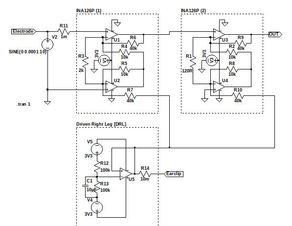

# **The Quron Project Report 2**
<script id="MathJax-script" async src="https://cdn.jsdelivr.net/npm/mathjax@3/es5/tex-mml-chtml.js"></script>
**Author**: Martin McCorkle <br> **Email**: mamccorkle1@ualr.edu <br> **Date**: November 26, 2024 <br>

## **1. Project Goal**
With industry-leading 8 and 16-channel EEG monitoring devices retailing for upwards of \$2,000 and \$3,500, respectively, there is a growing need for affordable, entry-level alternatives as the BCI market continues to expand. The Quron Project builds on well-documented hardware and aims to provide a cost-effective, open-source solution, making neuroscience education more accessible for individual makers, students, and university programs.

## **2. Progress Overview**

### **2.1 Hardware**

#### **2.1.1 Battery Management System**
To enable mobility for the EEG headset, a reliable and efficient power management system is essential. The system is designed to incorporate a Battery Management System (BMS) powered by three 18650 lithium-ion batteries, selected for their compact size, lightweight design, and high energy density. These batteries provide sufficient power to support the operation of the BeagleBone Black (BBB) while maintaining portability.
##### 2.1.1.1 **Battery Specifications**

- Battery Type: 18650 Lithium-ion
- Nominal Voltage: 3.7V
- Capacity: 9Ah (combined in parallel)
- Energy Storage: 33.3Wh (3.7V * 9Ah)
  
##### 2.1.1.2 **Estimated Runtime**

Based on the BeagleBone Black's typical power consumption (~7W), the battery system is expected to provide approximately 5 hours of continuous operation:


##### 2.1.1.3 **Safety Features**
The BMS ensures the safe and efficient operation of the battery pack and includes the following key features:
- **Overcharge Protection:** Prevents cell voltage from exceeding 4.2V.
- **Over-discharge Protection:** Ensures cell voltage does not drop below 2.5V to prevent damage.
- **Current Regulation:** Monitors and limits current to protect the battery pack and connected devices.

##### 2.1.1.4 **Key Components**
- **Battery Charging IC:** Manages safe charging of 18650 cells.
- **Protection IC:** Provides overcharge and over-discharge safety.
- **Connectors/Solder:** High-quality connectors or solder ensure secure power delivery.

##### 2.1.1.5 Schematic


##### 2.1.1.6 PCB Layout


#### 2.1.2 Updated SPICE Simulation Circuit
The LTSpice schematic below represents an updated design for the EEG signal amplification circuit, optimized for precise signal acquisition and noise reduction. The circuit utilizes instrumentation amplifiers (INA126P) in a two-stage amplification configuration and incorporates a Driven Right Leg (DRL) system for active noise cancellation. 


#### 2.1.3 Quron Cape Schematic
The schematic for the Quron Cape integrates the EEG acquisition system with the BeagleBone Black, providing precise signal amplification, efficient power management, and reliable data acquisition. At the core of the design are INA126 instrumentation amplifiers configured in a multi-stage setup to amplify weak EEG signals while rejecting common-mode noise. To ensure signal quality, low-pass and high-pass filters are implemented to eliminate high-frequency interference and DC offset, isolating the relevant EEG frequency bands.

An analog multiplexer is included to interface multiple EEG electrodes with the system, allowing for seamless channel switching and scalability for multi-channel EEG setups. Additionally, a Driven Right Leg (DRL) circuit is employed to actively cancel common-mode noise by driving the reference electrode with an inverted noise signal, ensuring clean and stable EEG measurements. Finally, the system incorporates an analog-to-digital converter (ADC) to digitize the conditioned EEG signals, enabling real-time processing by the BeagleBone Black. Together, these components create a robust and efficient platform for EEG signal acquisition and analysis.<br>


#### 2.1.4 Circuit Validation (First EEG Signal)
On Monday (11/25/2024), I had the opportunity to test the EEG circuit using an electrode and earclip repurposed from a MindFlex EEG headset. After setting up the circuit on a breadboard and connecting the electrode to my forehead, I observed distinct patterns within the outputted waves on the oscilloscope. This behavior was consistent only when the electrode was attached, suggesting that the circuit successfully captured signals potentially originating from brainwave activity.

The observed waveforms displayed variations that appeared to correspond to changes in electrical activity. However, further testing is necessary to confirm the nature of these signals and to filter out potential noise or artifacts. This initial test represents a significant step forward in validating the functionality of the Quron EEG acquisition system and understanding the range and fidelity of the signals it can capture. Future work will involve refining the signal processing and conducting additional experiments to ensure the circuit accurately reflects brainwave activity. <br>
 <br>


#### 2.1.5 Quron Cape Enclosure (By Colby Martinez)


### Code Details
- **Operating System:** BeagleBoard Debian Linux 12 Bookworm IoT Image

- **Kernel Version:** 5.10.168-ti-r72

- **C++ Compiler:** arm-linux-gnueabihf-g++
- **C++ version:** 12.2.0

- **Python Version:** 3.11.2

### C++
C++ is the preferred choice for the hardware-level programming in the Quron project due to its efficiency, control, and widespread adoption in open-source embedded systems like Arduino. Its ability to directly interact with hardware through low-level access to memory and registers makes it ideal for managing critical operations in real-time. The extensive library support and active community around C++ in embedded development ensure compatibility with a wide range of sensors, microcontrollers, and peripherals, including the BeagleBone Black. By leveraging C++, the Quron project ensures precise hardware control, high performance, and seamless integration with open-source tools and frameworks commonly used in the embedded systems community.
#### GPIO Class
```c++
// Sets INPUT/OUTPUT direction of selected pin
int gpio::set(int pin, bool value)  {
    
    std::string filename = gpioFileDir + std::to_string(pin) + "/direction";
    std::ofstream file(filename);

    if (file.is_open()) {
        file << (value ? "out" : "in");  // Write 1 if true, 0 if false
        file.close();
    } else {
        std::cerr << "Failed to open the file." << std::endl;
    }

    return 0;
}
```
```c++
// Returns the value of the selected pin (0 or 1)
int gpio::read(int pin) {
    
    std::string filename = analogFileDir + "in_voltage" + std::to_string(pin) + "_raw";

    std::ifstream file(filename);
    std::string value;

    if (file.is_open()) {
        
        file >> value;
        file.close();

    } else {

        std::cerr << "Error opening file!" << std::endl;
        return -1;

    }

    return std::stoi(value);

}
```
```c++

// Writes a HIGH/LOW value to selected pin
int gpio::write(int pin, bool value) {
    
    std::string filename = gpioFileDir + std::to_string(pin) + "/value";
    std::ofstream file(filename);

    if (file.is_open()) {

        file << (value ? 1 : 0);  // Write 1 if true, 0 if false
        file.close();

    } else {

        std::cerr << "Failed to open the file." << std::endl;

    }

    return 0;

}
```
### Analog Class
```c++
// Reads analog input from ADC (AIN0-7)
int analog::read(int pin) {
    
    std::string filename = analogFileDir + "in_voltage" + std::to_string(pin) + "_raw";

    std::ifstream file(filename);
    std::string value;

    if (file.is_open()) {
        
        file >> value;
        file.close();

    } else {

        std::cerr << "Error opening file!" << std::endl;
        return -1;

    }

    return std::stoi(value);

}
```
### Inter-Process Comm. (IPC) Class
```c++
// Inits UDP socket
IPC::IPC() {

    if ((*sockfd = socket(AF_INET, SOCK_DGRAM, 0)) <= 0) {
        std::cerr << "Failed to create socket" << std::endl;
        return;
    } else {
        // std::cout << "Socket Initialized..." << std::endl;
    }

    int broadcast = 1;
    if (setsockopt(*sockfd, SOL_SOCKET, SO_BROADCAST, &broadcast, sizeof(broadcast)) < 0) {
        std::cerr << "Failed to set broadcast option" << std::endl;
        close(*sockfd);
        return;
    }

    servAddr.sin_family = AF_INET;
    servAddr.sin_port = htons(PORT);

    if (inet_pton(AF_INET, IPV4_ADDR, &servAddr.sin_addr) <= 0) {
        std::cerr << "Invalid address/Address not supported" << std::endl;
        close(*sockfd);
        return;
    }

} 

// Closes socket and frees sockfd
IPC::~IPC() {
    close(*sockfd);
    delete sockfd;
} 

// Broadcasts data via UDP to hard coded address (0.0.0.0)
int IPC::send(const std::string *data) {
    if (*sockfd <= 0) {
        std::cerr << "Socket not initialized properly" << std::endl;
        return -1;
    }

    ssize_t sent_bytes = sendto(*sockfd, data->c_str(), data->size(), 0,
                                (struct sockaddr*)&servAddr, sizeof(servAddr));
    if (sent_bytes < 0) {
        std::cerr << "Failed to send broadcast message" << std::endl;
        return -1;
    }

    // std::cout << "Sending Data... " << std::endl;
    return 0;
} 

// Returns UDP Packets received from any address
int IPC::receive(unsigned char *buffer) {
    // In the works
    return 0;
}
```

### Blink Sketch
```c++
/*
    blink.cpp

    Repeatedly turns GPIO60 on and off in 1 second intervals.

    created 12 Nov 2024
    by Martin McCorkle

    This example code is in the public domain.
*/
#include "bbblib.hpp"

int main() {
    
    // Initialize gpio and set GPIO60 to output
    BBB::gpio gpio;
    gpio.set(60, OUTPUT);

    // Sets GPIO60 to inverse of current state and waits 1 second
    while (true) {
        gpio.write(60, HIGH);
        sleep(1);
        gpio.write(60, LOW);
        sleep(1);
    }   
}
```

### Python

Python is the ideal choice for high-level control of EEG data in the Quron project due to its simplicity, versatility, and widespread use in neuroscience. Its accessible syntax lowers barriers for users, while libraries like NumPy, SciPy, and TensorFlow streamline data analysis and machine learning development. Python’s dominance in neuroscience, with tools like MNE-Python and Brainstorm, ensures alignment with industry standards. Additionally, hardware abstraction libraries enable seamless integration with the BeagleBone Black and EEG equipment, making Python a powerful and user-friendly choice.

#### data_stream.py
```python
#   data_stream.py
#
#   Creates and connects to the BeagleBone Black's local
#   UDP socket to stream EEG data.
#
#   created 12 Nov 2024
#   by Martin McCorkle
#
#   This example code is in the public domain.

import socket

def udp_server(host="127.0.0.1", port=50505):
    try:
        # Create a UDP socket
        udp_sock = socket.socket(socket.AF_INET, socket.SOCK_DGRAM)
        
        # Bind the socket to the specified address and port
        udp_sock.bind(host, port)

        while True:
            # Receive data from any client
            data, addr = udp_sock.recvfrom(1024)  # Buffer size is 1024 bytes
            print(f"{data.decode()}")
    
    except KeyboardInterrupt:
        print("\nServer stopped.")
    except Exception as e:
        print(f"An error occurred: {e}")
    finally:
        udp_sock.close()
```


## **3. Current Tasks**

### 3.1 Improving the Code
- The `gpio.write()` and `analog.read()` functions, which are critical for the device's functionality, can be optimized for performance by rewriting them in assembly language. This approach reduces execution time by providing direct hardware-level control, ensuring faster response times for critical operations.

- The onboard Programmable Real-Time Unit and Industrial Communication Subsystem (PRU-ICSS) can be utilized to offload time-sensitive tasks from the main CPU. Acting as a dedicated microcontroller, the PRU-ICSS enables efficient parallel processing, improving overall system performance and freeing up CPU resources for higher-level functions.

- To enhance processing speed, the BeagleBone Black can be overclocked to 1.1 GHz. However, overclocking increases the risk of overheating, making effective thermal management, such as the use of heat sinks or active cooling solutions, essential to maintain system stability and longevity.

### 3.2 Circuit Schematic
Refine the circuit schematic to ensure all components, connections, and power management details are accurately documented for the current design.

### 3.3 Circuit Simulations/Validation Tests
Run simulations to verify the circuit’s performance, including gain, noise rejection, and signal fidelity. Perform validation tests with the physical setup to ensure the circuit meets design specifications.

### 3.4 3D-Print the Case
Design and 3D print a case to house the EEG hardware for protection and portability. Start brainstorming improvements for the second revision of the case design, focusing on usability.

## **4. Updated Goals**

### 4.1 Finalizing the PCB Design
Complete testing and optimization of the circuit to ensure signal accuracy and reliability, addressing analog signal combination issues if they arise.
### 4.2 Software Development
Develop and test software for seamless data collection and streaming to external devices for further analysis. Begin building a user interface that enables users to visualize EEG data in real-time.
### 4.3 Testing and Quality Assurance
Conduct rigorous testing to validate performance across different use cases and refine the product to meet educational and research standards.
### 4.4 Setup Pick-&-Place Machine and Reflow Oven
With the help of Chuck Hancock, I will gain access to and relocate the school's pick-&-place machine and reflow oven. These tools are essential for large-scale electronics assemblies.

## Sources
- https://github.com/upsidedownlabs/BioAmp-EXG-Pill/blob/main/graphics/docs/BioAmp-EXG-Pill-v1.0b-schematic.png
- International Neuroinformatics Coordinating Facility (INCF). (2023). Survey on programming tools in neuroscience. INCF Reports. https://www.incf.org/