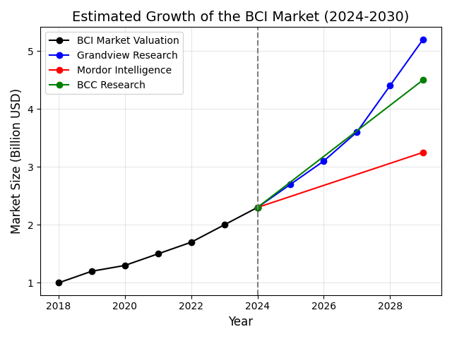

# **The Quron Project Report 3: Commercialization**

**Author**: Martin McCorkle   **Email**: mamccorkle1@ualr.edu   **Date**: December 9, 2024  

## **1. Project Goal**
With industry-leading 8- and 16-channel EEG monitoring devices retailing for upwards of \$2,000 and \$3,500, respectively, there is a growing need for affordable, entry-level alternatives as the BCI market continues to expand. The Quron Project builds on well-documented hardware and aims to provide a cost-effective, open-source solution, making neuroscience education more accessible for individual makers, students, and university programs. Beyond education, the project also seeks to develop a commercial option that balances affordability with high performance, while driving innovative applications for BCIs, such as mind-controlled systems in automotive technology, immersive VR/XR platforms, and neurorehabilitation tools.

## **2. Context**

### The Rapid Rise of Neuroscience and BCIs

In recent years, neuroscience has emerged as a focal point of innovation, driving significant advancements in the development of Brain-Computer Interfaces (BCIs). These cutting-edge technologies, which establish direct communication pathways between the brain and external devices, are no longer confined to the realm of research. They are increasingly entering mainstream applications, from medical therapies for neurological disorders to augmentative communication devices and cognitive enhancement tools. The rapid progress in understanding brain activity has directly fueled breakthroughs in the BCI field, positioning it as one of the most transformative technologies of the decade.

Simultaneously, the rise of autonomous vehicles has highlighted new opportunities for BCIs. As cars become increasingly intelligent, researchers and engineers are exploring how BCIs can provide an additional layer of control or feedback for drivers. For example, BCIs could offer solutions for individuals with disabilities, enabling direct interaction with vehicles without the need for traditional controls. This synergy between two innovative fields—neuroscience and autonomous systems—offers a glimpse into the potential of future technologies to seamlessly integrate with human cognition.

### Financial Projections

The financial world has taken notice of the rapidly growing BCI market, with institutions projecting exponential growth over the next decade. Claims suggest that as BCI applications diversify—from healthcare and gaming to workforce optimization and beyond—the industry could see multi-billion-dollar valuations. Notably, Asia is emerging as the fastest-growing market for BCIs, driven by strong government funding, expanding tech ecosystems, and increasing consumer interest in innovative neurotechnology. This region is expected to lead the global charge in adopting BCI solutions, thanks to its focus on both affordability and scalability.

The graph illustrates several financial projections for the BCI market from major research firms. According to the data, the market size is expected to surpass $5 billion by 2030, with estimates from Grandview Research indicating the highest growth trajectory. Comparatively, Mordor Intelligence predicts more modest growth, while BCC Research provides an intermediate projection. All sources agree on a steady upward trend, with the market poised to more than double in size from its current valuation by the end of the decade. These figures underscore the rapid pace of innovation and adoption in the BCI space, further solidifying its status as a transformative industry.

As neuroscience continues to unlock the mysteries of the brain, the intersection of advanced technologies such as BCIs and autonomous systems presents a transformative shift. The next decade will likely define how these technologies integrate into daily life, fueled by growing investment, research breakthroughs, and global adoption. The alignment of research insights and market growth forecasts suggests that BCIs will play a central role in shaping the future of neurotechnology-driven applications across the globe.

### Growth in Foreign Markets and Its Implications

Asia’s emergence as the fastest-growing market for Brain-Computer Interface (BCI) technology has significant global implications. With countries like China, Japan, and South Korea heavily investing in neuroscience and neurotechnology, Asia is rapidly establishing itself as a global leader in the BCI field. Government initiatives, robust funding for research and development, and a strong focus on scaling neurotechnology for consumer markets have created an ecosystem where innovation is thriving. This rapid progress is setting a competitive benchmark for other regions.

In response, the United States may feel increasing pressure to maintain its leadership in neuroscience and related technologies. Historically, U.S. institutions like the National Institutes of Health (NIH) and leading universities have spearheaded groundbreaking neuroscience research. However, with Asia’s advancements, there is growing recognition that maintaining a competitive edge will require significant investment. This could translate into more robust funding for top neuroscience institutions and public-private partnerships aimed at advancing BCI research and development. Increased funding would not only help the U.S. catch up but could also support the translation of cutting-edge research into commercially viable solutions.

As global competition in neuroscience and BCI intensifies, the potential for collaborations, knowledge sharing, and strategic investments grows. However, without proactive measures, the U.S. risks falling behind in a field poised to reshape industries ranging from healthcare to transportation. The next decade will likely see a race to dominate the BCI market, with Asia’s momentum acting as a catalyst for greater U.S. investment.

## **3. Applications**
The versatility of Brain-Computer Interfaces (BCIs) is becoming increasingly evident as the technology finds applications across diverse fields, pushing the boundaries of what human-machine interaction can achieve. From revolutionizing the way we drive to transforming biomedical devices, BCIs are poised to redefine multiple industries.

### Vehicles: Rethinking Human-Vehicle Interaction

In the automotive industry, BCIs are emerging as a potential game-changer. As autonomous vehicles gain traction, BCIs provide an innovative layer of control, allowing drivers to interact with their vehicles through thought alone. This technology could be particularly beneficial for individuals with disabilities, enabling seamless navigation and safety monitoring. Future advancements may even integrate BCIs to enhance driver focus or provide emergency override capabilities, creating a synergistic relationship between human cognition and machine intelligence.

### VR/XR: A New Frontier in Immersive Experiences

Virtual Reality (VR) and Extended Reality (XR) platforms are leveraging BCIs to elevate immersion to unprecedented levels. By decoding brain signals, BCIs enable users to interact with virtual environments more naturally, bypassing the need for traditional controllers. Imagine navigating a virtual world or manipulating objects simply by thinking about them. This capability opens up new possibilities in gaming, training simulations, and remote collaboration, offering experiences that feel deeply intuitive and personalized.

### Biomedical Devices: Transforming Healthcare

One of the most impactful applications of BCIs lies in the biomedical field. BCIs are already being used to assist individuals with paralysis, enabling them to control prosthetic limbs or communicate using neural signals. Beyond assistive technologies, BCIs are making strides in neurorehabilitation, helping stroke survivors regain motor functions through direct brain-computer communication. In the future, BCIs could enable real-time monitoring and treatment of neurological conditions, from epilepsy to Parkinson’s disease, offering a paradigm shift in personalized healthcare.

### BCI System-on-Chip (SoC): Powering the Next Generation

The development of specialized Brain-Computer Interface System-on-Chip (BCI SoC) architectures is paving the way for compact, high-performance devices. These chips integrate signal processing, machine learning, and connectivity into a single platform, enabling real-time decoding of brain activity with minimal latency. BCI SoCs are set to become the backbone of portable neurotechnology, powering devices ranging from wearables to implantables. This innovation not only makes BCIs more accessible but also enhances their efficiency and reliability in real-world applications.

## **4. Implementation**

The current focus is on developing an EEG-based Brain-Computer Interface (BCI) using low-cost, open-source hardware lays the groundwork for innovative and scalable applications. This approach not only reduces development costs but also increases accessibility, enabling broader adoption across various sectors. By leveraging open-source frameworks, the implementation strategy emphasizes collaboration and rapid iteration, aligning with market needs and fostering innovation.

### Applications in Development

The immediate application under consideration is the integration of the BCI system into a groundbreaking concept: a mind-controlled racing vehicle. This application combines cutting-edge technology with a high-profile, performance-driven domain to demonstrate the capabilities of the BCI system. By enabling direct control of throttle and braking functions through brain activity, this project highlights the potential for BCIs to revolutionize human-machine interaction in competitive and professional settings. The mind-controlled racing vehicle would not only showcase the system’s robustness and precision but also serve as a compelling proof of concept for broader adoption in automotive and transportation industries.

### Scaling to Market Applications

Parallel to this innovation, plans are underway to develop a Brain-Computer Interface System-on-Chip (BCI SoC) for consumer and industrial markets. This strategic pivot builds on the learnings from the mind-controlled racing vehicle to address the following market verticals:

- Healthcare and Assistive Devices: Compact, affordable BCI systems tailored for communication aids, neurorehabilitation, and prosthetic control.
- Gaming and Entertainment: Immersive experiences powered by thought-controlled interfaces, offering a new level of interactivity for VR and XR platforms.
- Industrial Automation: Enhancing human productivity by integrating BCIs into workflows where direct brain-machine communication could improve efficiency and reduce error rates.

The BCI SoC would provide a modular and scalable platform, enabling developers and businesses to integrate neurotechnology seamlessly into their products. By building a custom hardware solution, the project promotes collaboration while retaining opportunities for commercial licensing and partnerships.

### Strategic Vision for the Future

This dual-path strategy—combining the development of a high-impact, showcase application like the mind-controlled racing vehicle with the scalable production of a BCI SoC—positions the project for success in both niche and mainstream markets. The immediate focus on the automotive industry, one of the largest markets globally, underscores the immense potential for this technology to transform human-machine interaction in a sector already undergoing rapid innovation. By targeting a high-profile application, the project not only demonstrates the feasibility of BCIs in real-world scenarios but also establishes credibility in a competitive space. The intersection of innovation, accessibility, and market readiness creates a unique opportunity to lead in the emerging neurotechnology space, ensuring that while immediate applications capture attention and market share, the long-term focus on scalable products unlocks the broader potential of the BCI market.

## Sources 
1. Grand View Research. (n.d.). Brain-Computer Interface Market Size, Share & Trends Analysis Report by Product, by Application, by End Use, by Region, and Segment Forecasts, 2022–2030. Retrieved from https://www.grandviewresearch.com/horizon/outlook/brain-computer-interface-market-size/global

2. Mordor Intelligence. (n.d.). Brain-Computer Interface Market - Growth, Trends, COVID-19 Impact, and Forecasts (2023–2028). Retrieved from https://www.mordorintelligence.com/industry-reports/brain-computer-interface-market

3. BCC Research. (n.d.). Brain-Computer Interface: Applications and Global Markets. Retrieved from https://www.bccresearch.com/market-research/instrumentation-and-sensors/brain-computer-interface-market.html